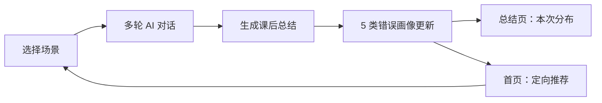
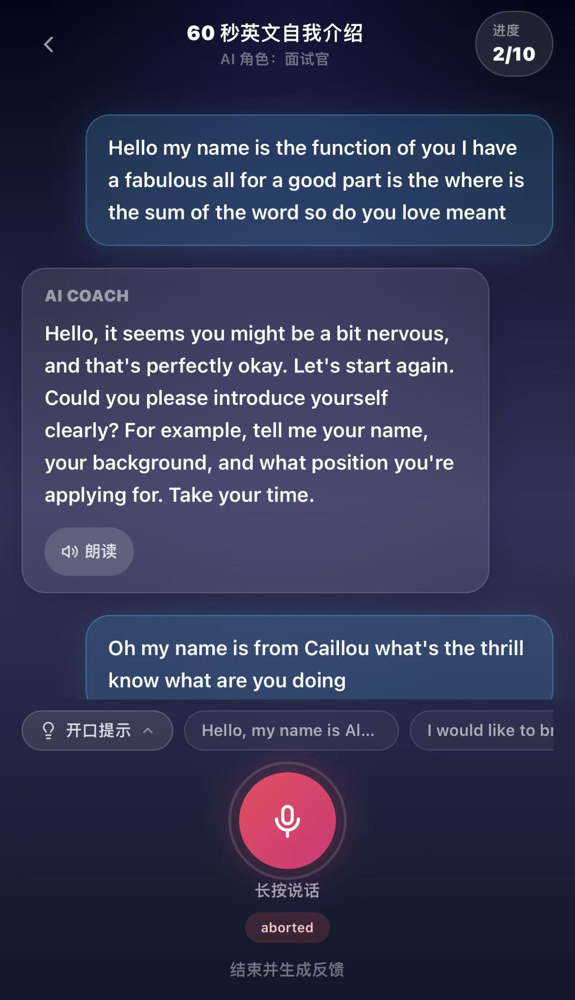
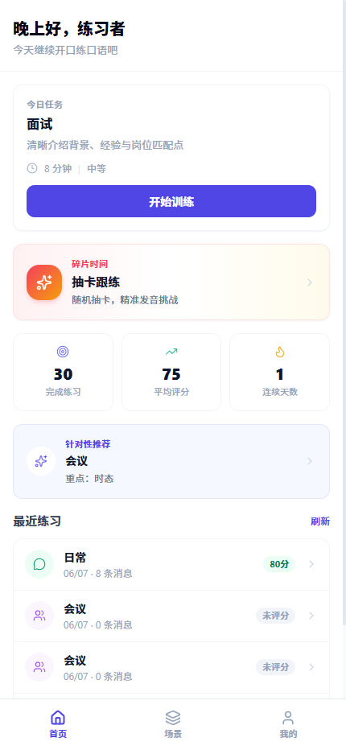
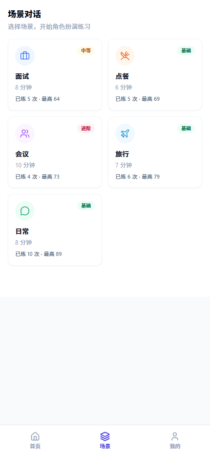
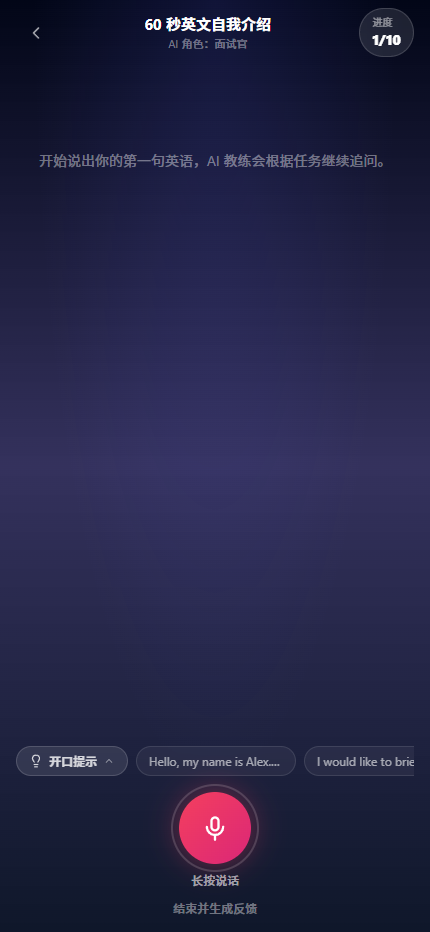
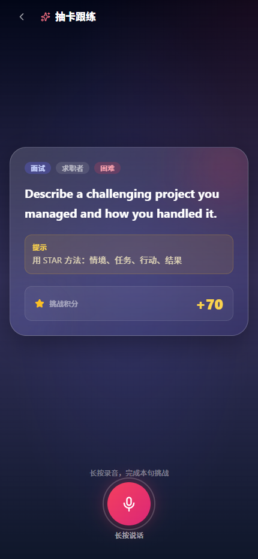
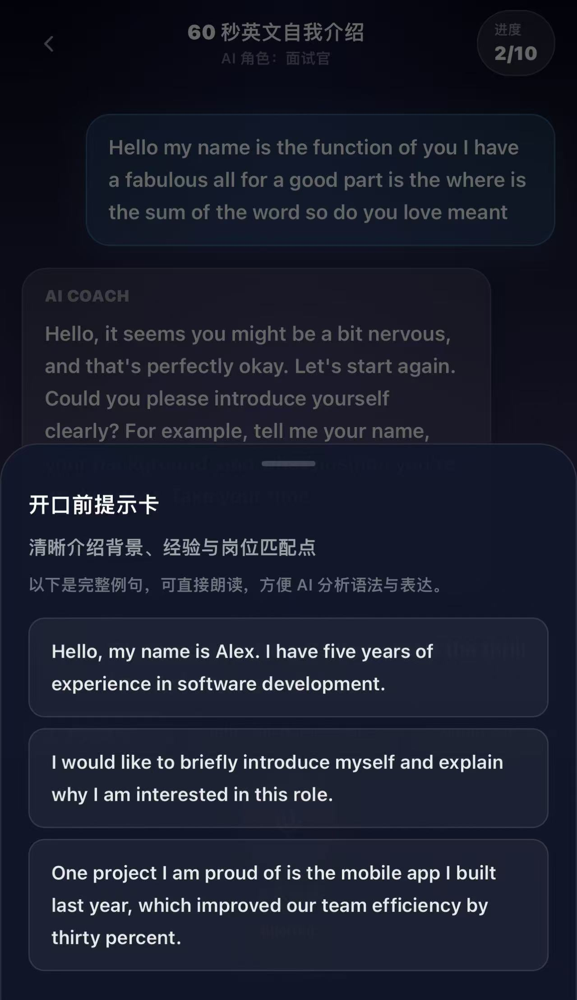
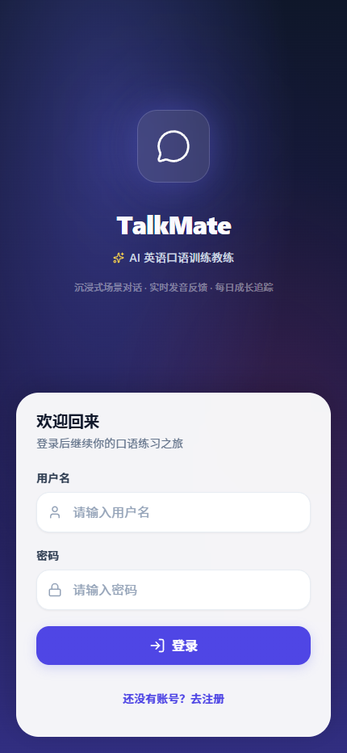
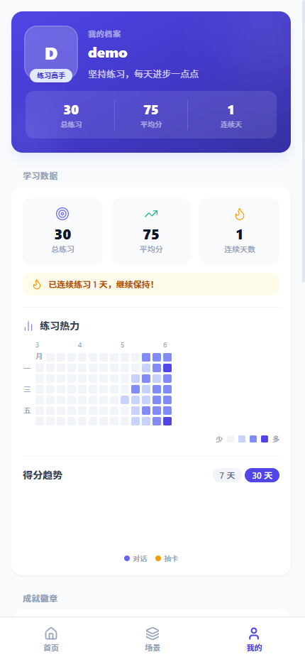
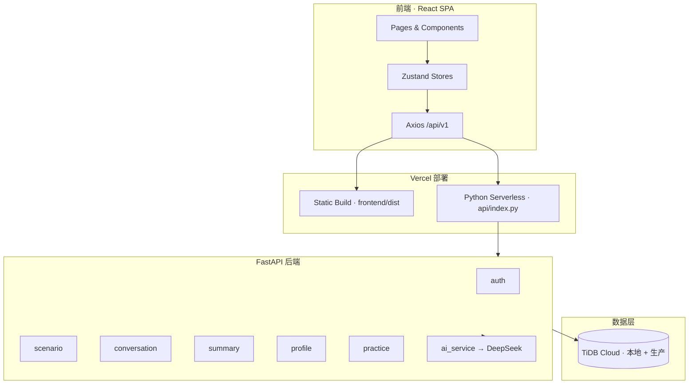

<div align="center">

# TalkMate

### AI 英语口语陪练 · 专为中国学习者诊断「中式英语」

> 不只告诉你「这次错了什么」，更帮你看见「你总在哪些地方翻车」，并给出下一次该怎么练。

[](https://talkmate-github-preview.vercel.app)
[](#版本路线)
[](#mvp-阶段说明)
[](#许可证)

[在线体验](https://talkmate-github-preview.vercel.app) · [快速开始](#快速开始) · [文档导航](#文档导航) · [未来规划](#未来规划)

</div>

---

## 目录

- [一句话介绍](#一句话介绍)
- [为什么选择 TalkMate](#为什么选择-talkmate)
- [产品闭环](#产品闭环)
- [MVP 阶段说明](#mvp-阶段说明)
- [当前已实现功能](#当前已实现功能)
- [应用截图](#应用截图)
- [已知局限与待完善项](#已知局限与待完善项)
- [未来规划](#未来规划)
- [技术架构](#技术架构)
- [项目结构](#项目结构)
- [快速开始](#快速开始)
- [Vercel 部署](#vercel-部署)
- [版本路线](#版本路线)
- [文档导航](#文档导航)
- [开发与贡献](#开发与贡献)

---

## 一句话介绍

**TalkMate** 是一款面向中国英语学习者的 AI 口语陪练 Web 应用。用户在真实场景（面试、会议、旅行等）中与 AI 角色对话，获得结构化纠错与课后总结；系统进一步将错误归纳为 **5 类「中式英语」标签**，形成跨练习的弱项画像，并推荐下一次该练什么。

我们不做大而全的英语学习平台，只专注一件事：**让练习从「盲目重复」变成「刻意进步」。**

---

## 为什么选择 TalkMate

### 市场痛点

| 痛点 | 典型现状 | TalkMate 的回应 |
|------|----------|-----------------|
| **打分但不诊断** | 用户只知道分数，不知道老在哪儿犯错 | 5 类中式英语错误标签 + 跨练习弱项追踪 |
| **练习是孤岛** | 每次对话结束即遗忘，没有累积视角 | 滑动窗口画像 + 首页定向复练推荐 |
| **真人外教成本高** | ¥80–200/节，难以坚持 | AI 7×24 可用，零社交压力 |
| **通用 AI 缺体系** | ChatGPT 能聊，但不追踪你的长期弱项 | 场景化 prompt + 结构化总结 + 画像存储 |
| **课程 App 偏游戏化** | 流利说、多邻国重词汇/关卡，口语深度不足 | 聚焦场景对话 + 深度纠错链 |

### 核心差异化（我们的优势）

<table>
<tr>
<td width="25%" align="center"><strong>🎯 场景化</strong></td>
<td width="25%" align="center"><strong>🔍 深度纠错</strong></td>
<td width="25%" align="center"><strong>📊 中式英语画像</strong></td>
<td width="25%" align="center"><strong>🔄 复练闭环</strong></td>
</tr>
<tr>
<td valign="top">5 大高频场景：面试、点餐、会议、旅行、日常。AI 按场景角色扮演，贴近真实交流。</td>
<td valign="top">原文 → 正确表达 → 原因 → 改进建议，完整纠错链；含词汇分析与综合评分。</td>
<td valign="top">AI 自动将错误归入 5 类中式英语标签（语序/时态/冠词/介词/直译），而非笼统「语法错误」。</td>
<td valign="top">首页基于最近 5 次弱项推荐「下次练什么场景、重点改什么」，形成刻意练习闭环。</td>
</tr>
</table>

### 与竞品对比（MVP 视角）

| 能力维度 | 流利说 / 多邻国 | 通用 AI 对话 | 真人外教 | **TalkMate** |
|----------|----------------|--------------|----------|--------------|
| 场景化口语对话 | ★★ | ★★ | ★★★ | ★★★ |
| 结构化纠错反馈 | ★★ | ★★ | ★★★ | ★★★ |
| 中式英语专项诊断 | — | — | ★★（依赖老师） | ★★★ |
| 跨练习弱项追踪 | ★ | — | ★★ | ★★★ |
| 定向复练推荐 | ★ | — | ★★ | ★★★ |
| 低社交压力 / 低成本 | ★★★ | ★★★ | ★ | ★★★ |

> 数据来源：内部业务调研与 v0.1.0 MVP 范围定义，详见 [业务调研报告](docs/versions/v0.1.0/product/business-research.md)。

---

## 产品闭环



**用户价值路径：**

1. **练** — 在指定场景与 AI 完成多轮对话（支持语音输入 + TTS 播放）
2. **诊** — 对话结束后获得纠错反馈与综合总结（评分、语法、词汇、建议）
3. **看** — 系统将错误归纳为 5 类中式英语标签，沉淀为个人弱项画像
4. **练** — 首页推荐「建议场景 + 重点改善项」，引导下一次刻意练习

---

## MVP 阶段说明

> **当前处于 MVP 阶段（v0.2.0）**：核心链路已打通，但大量体验、数据与工程能力仍在迭代中。

| 维度 | 现状 |
|------|------|
| **产品** | 核心功能可用：场景对话、AI 总结、错误画像、首页推荐 |
| **体验** | 移动端 App 化 UI 已完成基础适配；部分页面仍使用占位/模拟数据 |
| **数据** | 画像需累计 ≥5 次**新生成总结**后解锁；旧总结无法自动回填画像 |
| **工程** | Vercel + TiDB Cloud（本地开发与生产共用）；Alembic 迁移尚未引入 |
| **测试** | 核心模块有单元测试；profile 专项测试与 E2E 覆盖仍在补充 |

**我们诚实说明：** MVP 的目标是验证「场景对话 + 中式英语诊断 + 定向复练」这条价值假设，而非交付一款功能完备的商业产品。

---

## 当前已实现功能

### v0.1.0 — 基础口语陪练 ✅

| 模块 | 能力 | 状态 |
|------|------|------|
| 用户体系 | 注册 / 登录 / JWT 会话 | ✅ |
| 场景练习 | 5 大场景卡片 + AI 角色对话 | ✅ |
| 语音交互 | 浏览器 STT 输入 + TTS 播放 | ✅ |
| 纠错反馈 | 原文 → 正确 → 原因 → 建议 | ✅ |
| 课后总结 | 评分、语法、词汇、改进建议 | ✅ |
| 练习记录 | 历史对话列表（场景、日期、评分） | ✅ |
| 移动端 UI | 375px–1440px 响应式 + 底部 Tab 导航 | ✅ |
| 部署 | Vercel Serverless + TiDB Cloud | ✅ |

### v0.2.0 — 中式英语画像 + 复练闭环 ✅

| 模块 | 能力 | 状态 |
|------|------|------|
| AI 增强 | 总结输出 `error_profile`（5 类 + unknown 兜底） | ✅ |
| 画像存储 | `user_error_profiles` 表，累计计数 + 最近 5 次滑动窗口 | ✅ |
| 总结页 | `ErrorProfileCard` — 本次错误分布柱状图 | ✅ |
| 首页 | `TrainingRecommendBanner` — 个性化场景推荐 | ✅ |
| 数据一致性 | 删除对话时从滑动窗口移除，累计计数保留 | ✅ |
| API | `GET /profile/error-summary`、`GET /profile/next-goal` | ✅ |

#### 5 类中式英语错误标签

| 错误类型 | 中文名 | 典型表现 | 推荐练习场景 |
|----------|--------|----------|--------------|
| `word_order` | 中式语序 | 受中文语序影响的表达顺序 | 面试 |
| `tense` | 时态 | 过去/现在/将来时态混用 | 会议 |
| `article` | 冠词 | a/an/the 缺失或误用 | 日常 |
| `preposition` | 介词 | in/on/at/to/for/with 误用 | 旅行 |
| `direct_translation` | 直译表达 | 语法正确但不地道 | 日常 |

#### 抽卡跟练（辅助模块）✅

- 随机练习卡片 + AI 语音评分（发音 / 语法 / 流利度）
- 成就徽章体系（初次尝试、连续打卡、满分达人等）

---

## 应用截图

> 移动端 375px 宽度下主要页面的实际效果。所有截图均来自 v0.2.0 实际部署版本。

### 登录

简洁的移动端登录入口，支持用户名密码登录与注册。



### 首页

进入应用后的第一屏：今日任务、抽卡跟练入口、学习统计（总练习/平均分/连续天数）、针对错误画像的定向推荐，以及最近练习记录。



### 场景对话

5 大场景（面试 / 点餐 / 会议 / 旅行 / 日常）按难度分级，展示已练次数与最高分，点击进入 AI 角色扮演对话。



### 场景对话 — 60 秒英文自我介绍

进入「面试」场景后的对话页：顶部显示场景目标与 AI 角色（面试官），实时进度（1/10），底部「长按说话」按钮触发 STT 语音输入。



### 场景对话 — 多轮交互

进度推进到 2/10 时，对话已展示用户消息、AI 教练的引导回复与朗读按钮。底部「开口提示」可唤起完整例句卡（见下图），帮助用户更准确地表达。



### 开口前提示卡

「开口提示」唤起的浮层：展示该场景的完整例句，可直接朗读，让 AI 更好地分析语法与表达。



### 抽卡跟练

随机抽取练习卡片（场景 + 角色 + 难度），配合「长按录音」AI 评分（综合分 + 发音 / 语法 / 流利度 + 反馈），轻量级刻意练习。



### 我的（个人中心）

学习数据汇总：总练习 / 平均分 / 连续天数；GitHub 风格练习热力图（最近练习分布）；得分趋势切换（7 天 / 30 天）；成就徽章入口。



---

## 已知局限与待完善项

以下问题已在内部审计中确认，**不影响核心链路存在，但会影响用户感知**：

| 类别 | 说明 | 计划处理 |
|------|------|----------|
| 画像解锁门槛 | 需 5 次新生成总结且 AI 返回有效 `error_profile` | v0.3.0 优化引导与旧数据回填 |
| API 失败静默 | 首页推荐 banner 在 API 失败时不展示任何引导 | v0.3.0 前端降级态 |
| 无独立画像页 | `error-summary` API 已实现，但「我的」页未消费 | v0.3.0 独立画像页 |
| 旧总结不兼容 | v0.2.0 前生成的总结无画像数据 | v0.3.0「重新生成总结」 |
| 数据库迁移 | 依赖 `init_db()` 建表，无 Alembic 版本管理 | v0.3.0 引入 migration |
| 测试缺口 | profile 模块无专项单元测试 | v0.3.0 补充 |
| 首页统计 | 部分统计仍 fallback 到 mock 数据 | v0.3.0 接入真实用户统计 API |
| 流式语音 | 当前为回合制，非实时流式对话 | v0.4.0+ |

---

## 未来规划

> 以下规划基于 PRD 明确不做项、技术可行性评估与 MVP 范围文档整理。**优先级与版本号可能在评审后调整。**

### v0.3.0 — 长期画像与体验完善

**主题：** 从「最近 5 次窗口」扩展到「看得见的长期进步」

| 编号 | 功能 | 用户价值 | 预期交付 |
|------|------|----------|----------|
| F-301 | **错误趋势图** | 按周/月查看 5 类错误的增减趋势，感知进步 | 折线图 + 时间筛选 |
| F-302 | **画像快照** | 保存每次总结后的画像快照，支持历史对比 | 新增 `profile_snapshots` 表 |
| F-303 | **独立能力画像页** | 「我的」页展示完整 5 类分布、累计 vs 近期对比 | 消费 `error-summary` API |
| F-304 | **旧总结重新生成** | 一键为历史对话重新生成含画像的总结 | 总结页「重新分析」按钮 |
| F-305 | **首页真实统计** | 完成练习数、平均分、连续天数接入后端 | 替换 mock 数据 |
| F-306 | **Banner 降级态** | API 失败时展示引导文案，而非空白 | 前端容错 |
| F-307 | **Alembic 迁移** | 生产 TiDB  schema 版本化管理 | 部署 runbook 更新 |
| F-308 | **Profile 单元测试** | 画像更新 / 推荐 / 删除同步全覆盖 | CI 集成 |

**验收方向：**

- 用户可在「我的」页查看完整错误画像
- 趋势图至少支持「最近 30 天」视图
- 旧对话可重新生成总结并获得 `error_profile`

---

### v0.4.0 — 智能推荐与纠错增强

**主题：** 从「最高频错误 → 固定场景」升级为「更懂你的教练」

| 编号 | 功能 | 用户价值 | 预期交付 |
|------|------|----------|----------|
| F-401 | **用户手动修正错误类型** | AI 分类不准时可手动调整，画像更可信 | 总结页编辑入口 |
| F-402 | **多维度推荐算法** | 结合错误频率、场景覆盖度、练习间隔综合推荐 | 推荐引擎 v2 |
| F-403 | **弱项专项练习包** | 针对单一错误类型生成 3–5 条针对性例句/对话 | 与抽卡跟练联动 |
| F-404 | **实时对话内纠错** | 对话过程中轻量提示（非打断式） | 可选开关 |
| F-405 | **多 LLM 切换** | 支持 DeepSeek / GPT 等模型按场景切换 | 配置化 + A/B |
| F-406 | **Prompt 版本管理** | prompt 变更可追踪、可回滚 | Git 化 prompt 仓库 |

---

### v0.5.0 — 语音与交互升级

**主题：** 更接近真实口语交流体验

| 编号 | 功能 | 用户价值 | 预期交付 |
|------|------|----------|----------|
| F-501 | **流式实时语音** | 降低回合制等待感，对话更自然 | WebRTC / 流式 STT |
| F-502 | **发音评测增强** | 音素级反馈，而不只是文本纠错 | 对接专业 ASR/评测 API |
| F-503 | **对话回放** | 回顾历史对话音频与纠错时间点 | 消息级标记 |
| F-504 | **离线练习模式** | 弱网环境下缓存卡片与例句 | PWA 能力 |

---

### v1.0 — 产品化与商业化探索

**主题：** 从 MVP 验证走向可持续产品

| 编号 | 功能 | 用户价值 | 预期交付 |
|------|------|----------|----------|
| F-601 | **第三方登录** | 微信 / 手机号一键登录，降低注册门槛 | OAuth 集成 |
| F-602 | **订阅与配额** | 免费额度 + 付费无限练习 | 计费模块 |
| F-603 | **管理后台** | 场景管理、用户数据、prompt 配置 | Admin SPA |
| F-604 | **学习报告导出** | PDF/图片分享「我的进步报告」 | 报告生成服务 |
| F-605 | **社区轻互动** | 匿名弱项排行、打卡分享（可选） | 社交模块 v1 |
| F-606 | **Native App** | iOS / Android 原生或 React Native | 待定技术选型 |

---

### 明确不在近期路线内

| 功能 | 原因 |
|------|------|
| 多语种支持（日语/韩语等） | 当前聚焦中文母语者的英语中式表达 |
| 完整课程商城 | 非核心定位，与「陪练 + 诊断」方向偏离 |
| 真人外教对接 | 成本高，与 AI 低成本定位冲突 |
| 复杂游戏化体系 | 避免偏离「刻意练习」核心价值 |

---

## 技术架构



### 技术栈

| 层级 | 技术选型 |
|------|----------|
| 前端 | React 18 · TypeScript · Vite · Tailwind CSS · Zustand · React Router |
| 后端 | FastAPI · SQLAlchemy 2.0 · Pydantic v2 · Pydantic Settings |
| 数据库 | TiDB Cloud MySQL（本地开发与 Vercel 生产共用） |
| AI | DeepSeek（deepseek-v4-flash，OpenAI 兼容协议） |
| 语音 | 浏览器 Web Speech API（STT + TTS，零额外成本） |
| 鉴权 | JWT（HS256）+ bcrypt 密码哈希 |
| 部署 | Vercel Serverless（Python）+ Vercel Static（前端） |
| 监控 | Vercel Logs · Vercel Inspect |

---

## 项目结构

```
talkmate/
├── api/                          # Vercel Serverless 入口
│   └── index.py
├── backend/
│   └── app/
│       ├── modules/
│       │   ├── auth/             # 注册 / 登录 / JWT
│       │   ├── scenario/         # 5 大场景 + seed
│       │   ├── conversation/     # 对话与消息
│       │   ├── summary/          # AI 总结与纠错
│       │   ├── profile/          # 错误画像（v0.2.0）
│       │   ├── practice/         # 抽卡跟练 + 成就
│       │   └── ai_service/       # DeepSeek 客户端 + Prompt
│       ├── core/                 # 配置、安全、异常
│       ├── db/                   # 数据库连接与 init_db
│       └── shared/               # 统一响应格式
├── frontend/
│   └── src/
│       ├── app/                  # 路由、Layout、Shell
│       ├── pages/                # 首页、场景、总结、个人中心
│       ├── features/             # 对话、场景、认证等业务模块
│       ├── components/           # ErrorProfileCard、TrainingRecommendBanner 等
│       ├── services/             # API 调用层
│       └── stores/               # Zustand 全局状态
├── docs/versions/                # 按版本归档的 PRD、设计、QA 文档
├── tests/                        # E2E 测试
├── vercel.json
└── README.md
```

---

## 快速开始

### 环境要求

| 依赖 | 版本 |
|------|------|
| Python | 3.12+ |
| Node.js | 18+ |
| DeepSeek API Key | 向项目负责人获取 |

### 1. 克隆仓库

```bash
git clone https://github.com/daidai5210/TalkMate.git
cd TalkMate
```

### 2. 启动后端

```bash
cd backend
python3 -m venv venv
source venv/bin/activate
pip install -r requirements.txt

cp .env.example .env
# 编辑 .env：填入 DATABASE_URL、TIDB_CA_PEM_B64、DEEPSEEK_API_KEY、JWT_SECRET 等
# TiDB 连接与 SSL 说明见 docs/versions/v0.1.0/deployment/vercel-tidb-ca.md

PYTHONPATH=. ./venv/bin/uvicorn app.main:app --host 0.0.0.0 --port 8000
```

健康检查：

```bash
curl http://localhost:8000/api/health
```

### 3. 启动前端

```bash
cd frontend
npm install

# 本地开发：连接本地后端
echo "VITE_API_BASE_URL=http://127.0.0.1:8000" > .env.local

npm run dev
# 浏览器访问 http://localhost:5173
```

### 4. 验证 v0.2.0 画像功能

1. 注册新用户（验证码见 `REGISTER_CAPTCHA` 环境变量）
2. 选择场景，完成对话并**生成总结**（重复 5 次）
3. 第 5 次后访问总结页 → 应看到「本次中式英语画像」卡片
4. 返回首页 → 应看到「建议练习」推荐 banner

> **注意：** 查看旧总结不会触发画像更新；每次需**新生成**总结。

---

## Vercel 部署

### 架构

| 组件 | 说明 |
|------|------|
| 前端 | Vercel Static Build → `frontend/dist` |
| 后端 | Python Serverless → `api/index.py` |
| API 路由 | 同源 `/api/*`，生产环境无需配置 `VITE_API_BASE_URL` |
| 数据库 | TiDB Cloud MySQL（SSL 连接） |

### 必需环境变量

| 变量 | 说明 |
|------|------|
| `DATABASE_URL` | TiDB MySQL 连接串 |
| `TIDB_CA_PEM_B64` | TiDB SSL 证书（Base64 编码） |
| `JWT_SECRET` | JWT 签名密钥（≥32 字符） |
| `CORS_ORIGINS` | 允许的前端域名 |
| `REGISTER_CAPTCHA` | 注册验证码（4 位数字） |
| `DEEPSEEK_API_KEY` | DeepSeek API 密钥 |
| `DEEPSEEK_BASE_URL` | 默认 `https://api.deepseek.com/v1` |
| `DEEPSEEK_MODEL` | 默认 `deepseek-v4-flash` |
| `DEEPSEEK_TIMEOUT` | API 超时秒数，建议 `10.0` |

### 部署步骤

1. Vercel 控制台导入 GitHub 仓库
2. 配置上述环境变量（Production + Preview 分别配置）
3. Push 到 `main` 触发自动部署
4. 验证：`/api/health` 返回 ok；注册登录正常；5 次练习后首页出现推荐

### 常见问题

<details>
<summary><strong>登录返回 500</strong></summary>

大概率是 `DATABASE_URL` 或 `JWT_SECRET` 未正确配置。检查 Vercel Dashboard → Environment Variables，并用 `vercel logs` 查看详细错误。

</details>

<details>
<summary><strong>首页看不到推荐 banner</strong></summary>

常见原因：① 练习次数不足 5 次；② 总结未新生成（旧缓存无 `error_profile`）；③ profile API 失败（检查 Network 面板）；④ 前端 `.env` 指向了未部署 v0.2.0 的远端 API。

</details>

<details>
<summary><strong>API 响应慢（10s+）</strong></summary>

Python Serverless 冷启动 + TiDB 首连耗时较长。可适当延长 `DEEPSEEK_TIMEOUT`，前端展示 loading 态，或升级 Vercel 计划。

</details>

更多细节：[Vercel 部署手册](docs/versions/v0.1.0/deployment/vercel-tidbcloud.md)

---

## 版本路线

| 版本 | 主题 | 状态 |
|------|------|------|
| **v0.1.0** | MVP + 移动端 App 化 + Vercel/TiDB 部署 | ✅ 已发布 |
| **v0.2.0** | 中式英语错误画像 + 个性化复练闭环 | ✅ 已发布 |
| **v0.3.0** | 趋势图 / 快照 / 独立画像页 / 工程完善 | 📋 规划中 |
| **v0.4.0** | 智能推荐 v2 + 手动修正 + 对话内纠错 | 📋 规划中 |
| **v0.5.0** | 流式语音 + 发音评测增强 | 📋 规划中 |
| **v1.0** | 产品化：登录扩展 / 订阅 / 管理后台 | 📋 远期 |

---

## 文档导航

| 文档 | 说明 |
|------|------|
| [v0.2.0 PRD](docs/versions/v0.2.0/product/prd.md) | 错误画像功能需求 |
| [v0.2.0 技术设计](docs/versions/v0.2.0/architecture/tech-design.md) | 数据模型、API、Prompt 设计 |
| [v0.2.0 QA 验收报告](docs/versions/v0.2.0/qa/acceptance-report.md) | 验收标准与测试结果 |
| [v0.1.0 MVP 范围](docs/versions/v0.1.0/product/mvp-scope.md) | MVP 功能边界 |
| [业务调研报告](docs/versions/v0.1.0/product/business-research.md) | 用户画像与竞品分析 |
| [Vercel 部署手册](docs/versions/v0.1.0/deployment/vercel-tidbcloud.md) | 生产环境部署 |
| [文档索引](docs/INDEX.md) | 完整文档目录 |

---

## 开发与贡献

### 代码规范

- 后端：[PEP 8](https://peps.python.org/pep-0008/)，类型注解完整
- 前端：ESLint + TypeScript strict
- 提交：[Conventional Commits](https://www.conventionalcommits.org/) 规范

### 测试

```bash
# 后端单元测试
cd backend && PYTHONPATH=. ./venv/bin/pytest app -q

# 前端构建验证
cd frontend && npm run build
```

### PR 流程

1. 从 `main` 创建特性分支：`git checkout -b feat/your-feature`
2. 提交并推送，创建 PR（含功能描述、实现思路、测试方式）
3. CI 通过后由 Reviewer 合并

---

## 团队

| 角色 | 职责 |
|------|------|
| PM / FS | 产品定义 + 全栈开发 |
| QA | 测试与运维 |
| 队长 | 项目决策与最终验收 |

---

## 许可证

Internal use only. 未经许可不得外传或商业化使用。

---

<div align="center">

**TalkMate** · 让中国英语学习者看见自己的「中式英语」画像

当前版本 **v0.2.0** · 最后更新 **2026-06-07**

</div>
